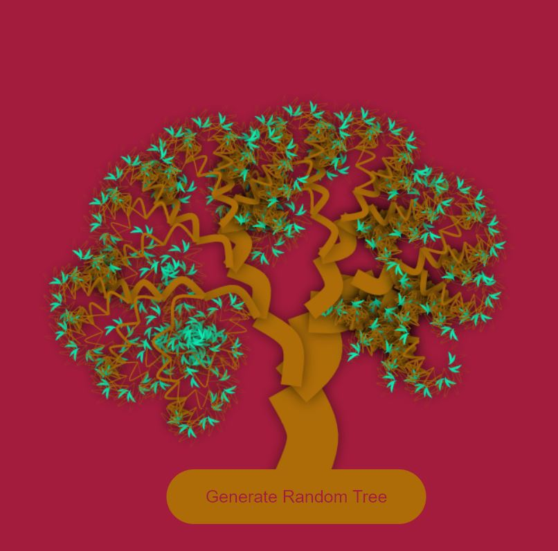
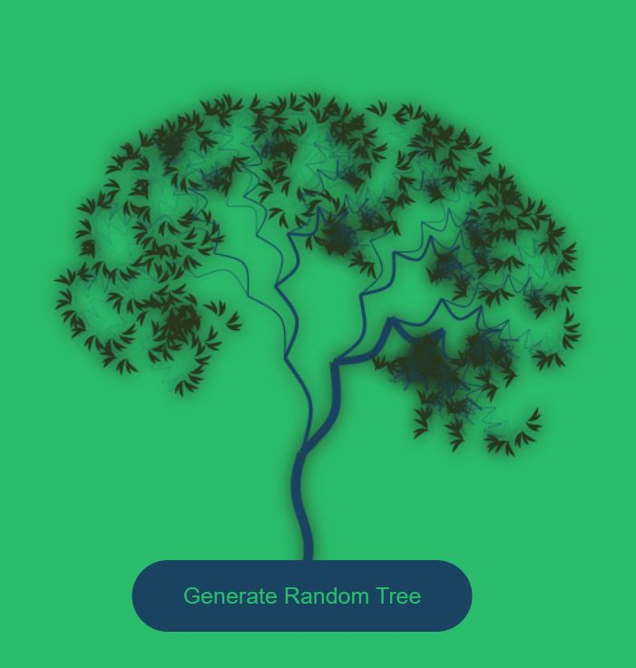
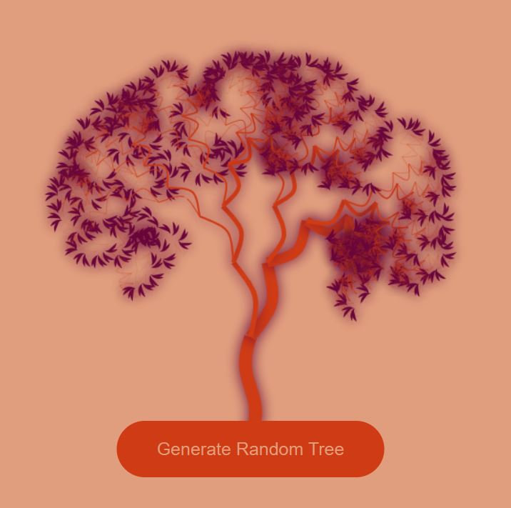
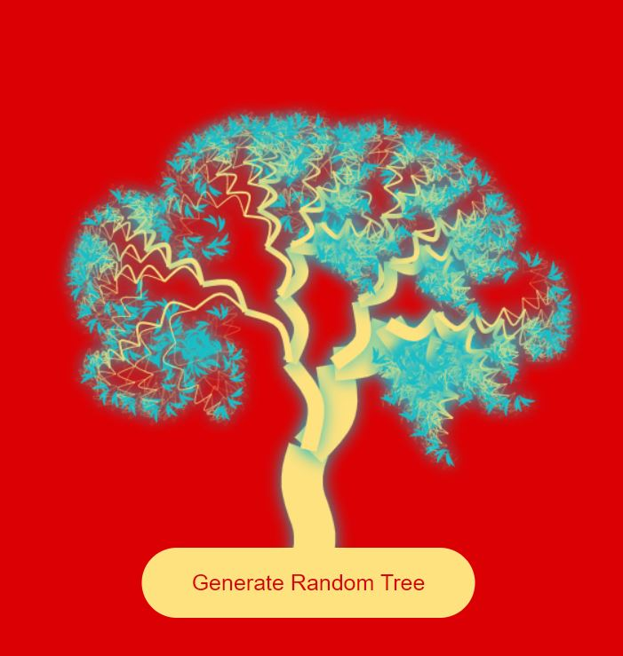
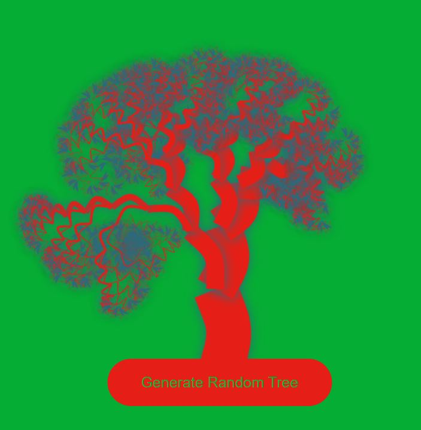

# generative-art-app

   

## Description
Designed a therapeutic generative art game for individuals of all ages to enjoy and build art skills.

## Table Of Contents
* [Links](#links)

* [Instructions](#instructions)

* [Screenshots](#screenshots)

## Links
[Git Repo](https://github.com/asantercureton/generative-art)

[Live Link - GitHub Pages](https://asantercureton.github.io/generative-art/)

## Instructions
Click the Generate Random Tree button to shuffle through a variety of randomized tree colors and shapes. Save images generated as a background or screensaver, or even create your own tree collage art!

## Screenshots
Below is a screenshot of the project:

---
© 2022 CCure Coaching, Arts & Apparel.