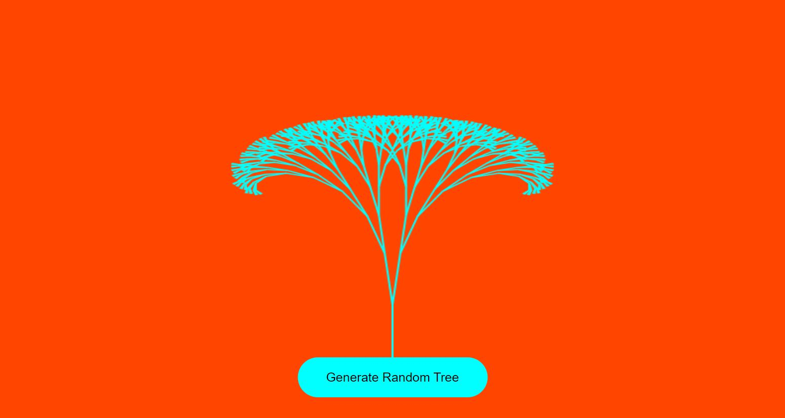

# generative-art-app

   

## Description
Designed a therapeutic generative art game for individuals of all ages to enjoy and build art skills.

<!-- [MADE FOR DESKTOP USE] -->

## Table Of Contents
* [Links](#links)

* [Instructions](#instructions)

* [Screenshots](#screenshots)

## Links
[Git Repo](https://github.com/asantercureton/generative-art)

<!-- [Live Link - GitHub Pages](https://asantercureton.github.io/generative-art/) -->

## Instructions
More info to come...

<!-- From the home screen, press the PLAY button to begin - The clock will start and a random quote will be generated. Begin typing the quote letter for letter (including space and punctuations) and increse score with each completed quote. 

Once finished, click the Done button to generate a Summary Report alert, which details previous typing metrics as well as the list of quotes completed to review and discuss.

A Reset Game button is available to reset the game after completion to beat your last score, or can be used to restart the game at the beginning in case you were not ready to start typing yet.

The Home button will end the game completely and redirect back to the home screen. -->

## Screenshots
Below is a screenshot of the project:

<!--  -->

<!--  -->

<!--  -->

---
© 2022 CCure Coaching, Arts & Apparel.